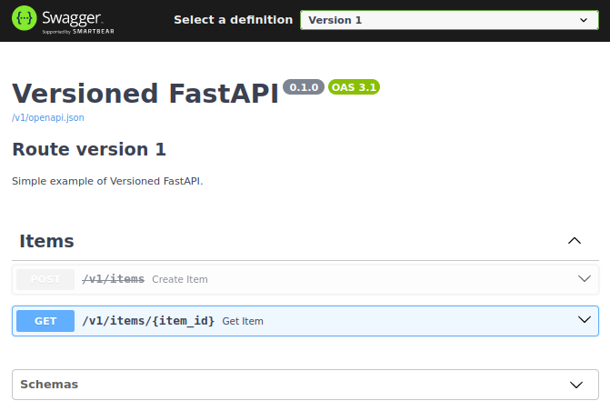

# Versioned FastAPI

Versioned FastAPI simplifies the versioning of FastAPI web applications.
This package is mainly designed for versioning of single endpoints.
It can also be used for versioning of entire APIs,
but then other packages like [FastAPI Versionizer](https://github.com/alexschimpf/fastapi-versionizer) might be a better
fit
if you are not interested in the modifications of the swagger docs.

Modifies the swagger documentation by adding a dropdown menu for easy switching between different versions.

## Credit

This project is inspired by [FastAPI Versionizer](https://github.com/alexschimpf/fastapi-versionizer) but is mainly
designed for versioning of single endpoints.

## Installation

```commandline
pip install versioned-fastapi
```

## Usage

A minimalistic example of how to use Versioned FastAPI:

```python
from fastapi import FastAPI, APIRouter, HTTPException
from pydantic import BaseModel
from versioned_fastapi import version, FastApiVersioner


# Versioned models
class Item(BaseModel):
    id: int
    name: str


class ItemV2(BaseModel):
    id: int
    name: str
    description: str


# Example db
db: dict[int, Item | ItemV2] = {}

# Create the FastAPI app ...
app = FastAPI(
    title="Versioned FastAPI",
    description="Simple example of Versioned FastAPI.",
)

# ... and routers as normal
items_router = APIRouter(
    prefix="/items",
    tags=["Items"]
)


# Use the @version annotation to add a version
# This endpoint will be available at "/v1/items"
@version(1)
@items_router.post("", status_code=201, deprecated=True)
async def create_item(item: Item):
    db[item.id] = item
    return item


# This endpoint will be available at "/v1/items"
@version(2)
@items_router.post("", status_code=201)
async def create_item_v2(item: ItemV2) -> ItemV2:
    db[item.id] = item
    return item


# This endpoint will be available at "/v1/items/{item_id}"
@version(1)
@items_router.get("/{item_id}")
async def get_item(item_id: int) -> Item | ItemV2:
    if item_id in db:
        return db[item_id]
    raise HTTPException(status_code=404, detail="Item not found")


app.include_router(items_router)

# Version your app
# It will add version prefixes and customize the swagger docs
versions = FastApiVersioner(app).version_fastapi()
```

In addition to the manipulation of the annotated routes, new and versioned openapi endpoints will be created.
To show the new openapi definitions the swagger ui will be customized.
You can switch between the versions via a dropdown menu.



The following endpoints will be available:

- **POST /v1/items**
- **POST /v2/items**
- **GET /v1/items/{items_id}**
- **GET /openapi.json** The openapi definition containing all routes of all versions
- **GET /v1/openapi.json** The openapi definition containing all routes of version 1
- **GET /v2/openapi.json** The openapi definition containing all routes of version 2
- **GET /docs** The customized Swagger documentation

## Customization

To customize the outcome you can use the init parameter of the FastApiVersioner class:

- **app**: The fastapi app to version, required.
- **default_version**: Default version to use if a route is not annotated with @version.
- **prefix_format**: Defines the format of the path prefix, should contain "{version}".
- **include_all_routes**: If True, the main openapi route without version prefix will be included in swagger as "All
  Routes".
- **primary_swagger_version**: The version to be displayed when the swagger ui loads. If None "All Routes" or the first
  version will be selected.

For further customization you can set some class parameter (see [customization example](examples/customization.py)) or
inherit the FastApiVersioner class.
But keep in mind that all protected methods and attributed might change in the future.

- **title_format**: Defines the format of the swagger title, can contain "{title}" and "{version}".
- **description_format**: Defines the format of the swagger description, can contain "{description}" and "{version}" and
  supports markdown.
- **summary_format**: Defines the format of the swagger summary, can contain "{summary}" and "{version}". Available
  since OpenAPI 3.1.0, FastAPI 0.99.0.
- **swagger_js_urls**: The URLs to use to load the Swagger UI JavaScript.
- **swagger_css_urls**: The URLs to use to load Swagger UI CSS. Leave None to use FastAPIs default.
- **swagger_favicon_url**: The URL of the favicon to use. Leave None to use FastAPIs default.

## Keep in mind

- Currently, the versioning of websockets is not supported, but this might be added in the future
- The Redoc documentation will not be modified and will always show all routes of all versions
- If you customized your swagger docs, this might conflict with the docs route created by this package
- If you customized the openapi endpoint, this will not affect the versioned endpoints
